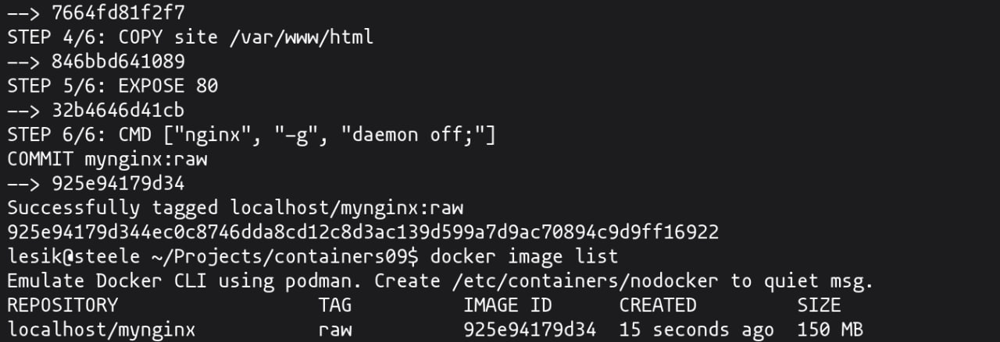
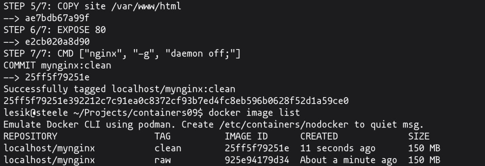
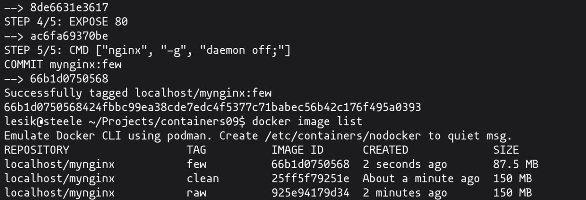
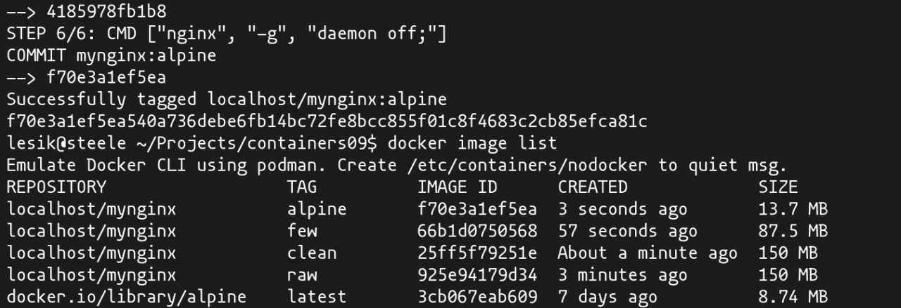
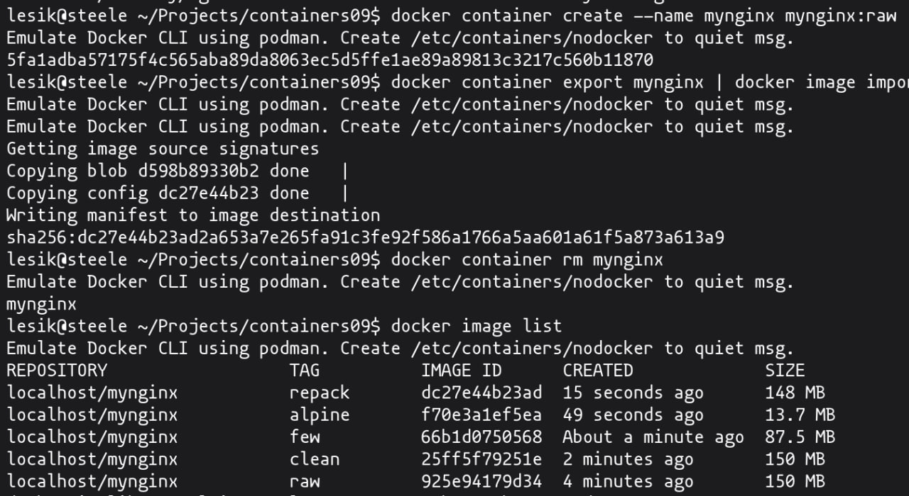
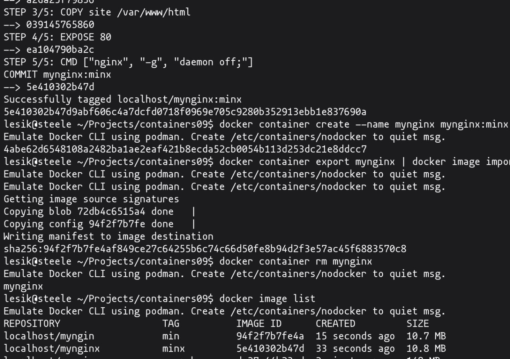

#+TITLE: Лабораторная работа: Оптимизация Docker-образов
Пустовой Алексей

* Цель работы
Целью работы является знакомство с методами оптимизации
Docker-образов.

* Задание
Необходимо сравнить различные методы оптимизации образов:
- Удаление неиспользуемых зависимостей и временных файлов
- Уменьшение количества слоев
- Использование минимального базового образа
- Перепаковка образа
- Комбинирование всех методов

* Подготовка
Создан репозиторий containers09, внутри которого размещена папка site
с файлами веб-сайта (html, css, js).

* Базовый образ (raw)

** Dockerfile.raw
#+begin_src dockerfile
FROM ubuntu:latest

RUN apt-get update && apt-get upgrade -y
RUN apt-get install -y nginx

COPY site /var/www/html

EXPOSE 80

CMD ["nginx", "-g", "daemon off;"]
#+end_src

** Сборка образа
#+begin_src bash
docker image build -t mynginx:raw -f Dockerfile.raw .
docker image list
#+end_src

** Результат
Скриншот сборки и списка образов:

* Удаление временных файлов и кэша (clean)

** Dockerfile.clean
#+begin_src dockerfile
FROM ubuntu:latest

RUN apt-get update && apt-get upgrade -y
RUN apt-get install -y nginx
RUN apt-get clean && rm -rf /var/lib/apt/lists/* /tmp/* /var/tmp/*

COPY site /var/www/html

EXPOSE 80

CMD ["nginx", "-g", "daemon off;"]
#+end_src

** Сборка
#+begin_src bash
docker image build -t mynginx:clean -f Dockerfile.clean .
docker image list
#+end_src

** Результат

* Уменьшение количества слоев

** Dockerfile.few
#+begin_src dockerfile
FROM ubuntu:latest

RUN apt-get update && apt-get upgrade -y && \
    apt-get install -y nginx && \
    apt-get clean && rm -rf /var/lib/apt/lists/* /tmp/* /var/tmp/*

COPY site /var/www/html

EXPOSE 80

CMD ["nginx", "-g", "daemon off;"]
#+end_src

** Сборка
#+begin_src bash
docker image build -t mynginx:few -f Dockerfile.few .
docker image list
#+end_src

** Результат

* Минимальный базовый образ (alpine)

** Dockerfile.alpine
#+begin_src dockerfile
FROM alpine:latest

RUN apk update && apk upgrade
RUN apk add nginx

COPY site /var/www/html

EXPOSE 80

CMD ["nginx", "-g", "daemon off;"]
#+end_src

** Сборка
#+begin_src bash
docker image build -t mynginx:alpine -f Dockerfile.alpine .
docker image list
#+end_src

** Результат

* Перепаковка образа

** Команды
#+begin_src bash
docker container create --name mynginx mynginx:raw
docker container export mynginx | docker image import - mynginx:repack
docker container rm mynginx
docker image list
#+end_src

** Результат

* Использование всех методов (min)

** Dockerfile.min
#+begin_src dockerfile
FROM alpine:latest

RUN apk update && apk upgrade && \
    apk add nginx && \
    rm -rf /var/cache/apk/*

COPY site /var/www/html

EXPOSE 80

CMD ["nginx", "-g", "daemon off;"]
#+end_src

** Сборка и перепаковка
#+begin_src bash
docker image build -t mynginx:minx -f Dockerfile.min .
docker container create --name mynginx mynginx:minx
docker container export mynginx | docker image import - mynginx:min
docker container rm mynginx
docker image list
#+end_src

** Результат

* Сравнение размеров образов

| Образ          | Размер  |
|----------------+---------|
| mynginx:raw    | 150 MB  |
| mynginx:clean  | 150 MB  |
| mynginx:few    | 87.5 MB |
| mynginx:alpine | 13.7 MB |
| mynginx:repack | 148 MB  |
| mynginx:minx   | 10.8 MB |
| mynginx:min    | 10.7 MB |

* Ответы на вопросы

** 1. Какой метод оптимизации наиболее эффективен?
Наиболее эффективным является использование минимального базового
образа (alpine), так как он значительно уменьшает начальный размер
системы и количество установленных пакетов.

** 2. Почему очистка кэша в отдельном слое не уменьшает размер образа?
Потому что каждый слой Docker сохраняется отдельно. Даже если файлы
удаляются в следующем слое, они остаются в предыдущем слое и
продолжают занимать место.

** 3. Что такое перепаковка образа?
Перепаковка образа - это создание нового образа путем экспорта
файловой системы контейнера и импорта её как нового образа. Это
позволяет «сжать» слои и удалить историю промежуточных слоев.

* Выводы
В ходе работы были рассмотрены основные методы оптимизации
Docker-образов. Было установлено, что наибольшее влияние на уменьшение
размера образа оказывает выбор базового образа и объединение команд в
один слой. Перепаковка позволяет дополнительно уменьшить размер за
счет удаления истории слоев.
